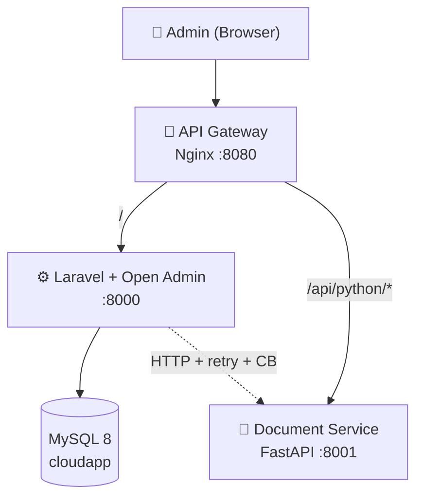

# ☁️ AI Document Validator App - PRIA SOLO

Aplikasi full-stack untuk mata kuliah Komputasi Awan (SI ITK). Backend FastAPI melayani REST API (Document Validator), frontend Laravel dengan Open Admin sebagai antarmuka yang mengonsumsi API. Proyek ini dikerjakan secara mandiri dalam konteks magang di , Telkom Regional IV Kalimantan Timur dengan ketentuan modul tetap mengacu pada struktur tugas berkelompok; seluruh peran tim diampu oleh satu anggota.

## 👥 Tim

| Nama   | NIM      | Peran            |
|--------|----------|------------------|
| Dyno Fadillah Ramadhani | 10231033 | Lead Backend     |
| Dyno Fadillah Ramadhani | 10231033 | Lead Frontend    |
| Dyno Fadillah Ramadhani | 10231033 | Lead DevOps      |
| Dyno Fadillah Ramadhani | 10231033 | Lead QA & Docs   |

## 🛠️ Tech Stack

Berdasarkan struktur proyek di `backend/` dan `frontend/`:

### Backend (`backend/`)
| Teknologi | Fungsi |
|-----------|--------|
| FastAPI | REST API & web framework |
| Uvicorn | ASGI server |
| Azure AI Document Intelligence | OCR & ekstraksi dokumen |
| LangChain & OpenAI | AI review & orkestrasi LLM |
| PyMuPDF, pdf2image, Pillow | Pemrosesan PDF & gambar |
| Pydantic | Validasi data & schema |
| SQLAlchemy | ORM & akses database |
| python-dotenv | Konfigurasi environment |
| Pytest | Testing |

### Frontend (`frontend/`)
| Teknologi | Fungsi |
|-----------|--------|
| Laravel (PHP 8) | Web application framework |
| Laravel Open Admin | Admin panel & backend UI |
| Blade | Template engine |
| Eloquent ORM | Database (MySQL) |
| Guzzle HTTP | HTTP client ke backend API |
| Open Admin extensions | CKEditor, Log Viewer, Media Manager, Config, Reporter, Scheduling, dll. |

### Infrastruktur & DevOps
| Teknologi | Fungsi |
|-----------|--------|
| Docker | Containerization |
| GitHub Actions | CI/CD |
| Railway/Render | Cloud deployment |

## 🏗️ Architecture



Detail reliability & ports: **[docs/architecture.md](docs/architecture.md)**

### Architecture Evolution

| Phase | Weeks | Architecture |
|-------|-------|--------------|
| Foundation | 1–4 | Full-stack: FastAPI + Laravel + MySQL |
| Containerization | 5–7 | Docker Compose (backend, frontend, DB) |
| CI/CD | 9–11 | GitHub Actions + Railway deployment |
| Microservices | 12–14 | Nginx gateway + document-service + monitoring |
| Final | 15–16 | Security hardened + dokumentasi UAS |

## 🌐 Live Demo (production)

| Service | URL |
|---------|-----|
| Frontend (Laravel) | [https://cc-kelompok-a-pria-solo-production.up.railway.app](https://cc-kelompok-a-pria-solo-production.up.railway.app) |
| Open Admin | [https://cc-kelompok-a-pria-solo-production.up.railway.app/projess/auth/login](https://cc-kelompok-a-pria-solo-production.up.railway.app/projess/auth/login) |
| Backend API (FastAPI) | [https://backend-production-bdd8.up.railway.app](https://backend-production-bdd8.up.railway.app) |
| Health check | [https://backend-production-bdd8.up.railway.app/health](https://backend-production-bdd8.up.railway.app/health) |
| API docs (Swagger) | [https://backend-production-bdd8.up.railway.app/docs](https://backend-production-bdd8.up.railway.app/docs) |

Detail setup & rollback: **[docs/deployment-guide.md](docs/deployment-guide.md)** · Release M3: **[docs/release-notes-m3.md](docs/release-notes-m3.md)** · Smoke test: **[docs/production-test.md](docs/production-test.md)**

## 🔄 CI/CD


Pada **push ke `main`** (setelah merge): lint backend (ruff), test backend (pytest), test frontend (`php artisan test`), build Docker, lalu **deploy ke Railway** jika secret `RAILWAY_TOKEN` di-set, plus **GET /health** jika `BACKEND_PRODUCTION_URL` di-set. Lihat [.github/workflows/ci.yml](.github/workflows/ci.yml).

**Secrets disarankan:** `RAILWAY_TOKEN`, `RAILWAY_PROJECT_ID`, `BACKEND_PRODUCTION_URL` = `https://backend-production-bdd8.up.railway.app`

## 🚀 Getting Started

Ringkas di bawah ini; **langkah lengkap** (clone → `.env` → DB → port): **[docs/setup-guide.md](docs/setup-guide.md)**.

### Prasyarat
- **Backend:** Python 3.10+, pip
- **Frontend:** PHP 7.3+ / 8.0+ (sesuai composer.json), Composer, MySQL
- Git
- **Environment:** salin `.env.example` (root) serta `backend/.env.example` dan `frontend/.env.example`

### Backend
```bash
cd backend
pip install -r requirements.txt
# Salin .env dari .env.example — isi AZURE_*, OPENAI_API_KEY, TEMP_STORAGE, ALLOWED_ORIGINS atau CORS_ORIGINS
uvicorn app.main:app --reload --port 8001
```
API: http://127.0.0.1:8001 — Docs: http://127.0.0.1:8001/docs

### Frontend
```bash
cd frontend
composer install
cp .env.example .env
php artisan key:generate
# Atur DB_* di .env dan URL_VM_PYTHON=http://127.0.0.1:8001 (base URL FastAPI, tanpa slash akhir)
php artisan migrate
php artisan serve --host=127.0.0.1 --port=8000
```
Aplikasi: http://127.0.0.1:8000 (pastikan backend FastAPI berjalan di port 8001)

## 🐳 Docker Compose (Modul 7)

Satu perintah menjalankan **MySQL 8**, **FastAPI** (port **8001**), dan **Laravel** (port **8000**). Data MySQL disimpan di volume bernama `pria-solo-mysql-data` sehingga tetap ada setelah `docker compose down` (tanpa `-v`).

### Prasyarat

- Docker Desktop (atau Docker Engine + Compose plugin)
- Salin file environment (satu kali setelah clone):

```bash
cp backend/.env.docker.example backend/.env.docker
cp frontend/.env.docker.example frontend/.env.docker
```

Isi `backend/.env.docker` dengan kredensial yang diperlukan (mis. `AZURE_*`, `OPENAI_API_KEY`, `TEMP_STORAGE`). File `*.env.docker` **tidak** di-commit (lihat `.gitignore`).

### Perintah cepat

```bash
make build          # atau: docker compose up --build -d
docker compose ps   # db + backend harus healthy; frontend mengikuti
make migrate        # pertama kali / setelah volume DB baru: php artisan migrate --force
```

- **Laravel:** http://localhost:8000  
- **FastAPI docs:** http://localhost:8001/docs  
- **MySQL dari host (opsional):** `localhost:3307` (user `clouduser`, DB `cloudapp`)

### Makefile (ringkas)

| Target | Fungsi |
|--------|--------|
| `make up` | `docker compose up -d` |
| `make build` | Build image + start (`docker compose up --build -d`) |
| `make down` | Stop & hapus container + network (volume **tetap**) |
| `make logs` / `make logs-backend` | Log semua service / backend saja |
| `make ps` | Status service |
| `make clean` | `docker compose down -v` + prune (⚠️ data DB hilang) |
| `make migrate` | Migrasi Laravel di container `frontend` |
| `make shell-backend` / `make shell-db` | Shell backend / MySQL |
| `make compose-images` | Build image `backend` + `frontend` dari Compose |
| `make compose-push-latest DOCKERHUB_USERNAME=... TAG=v1` | Tag + push kedua image ke Docker Hub (`v1` + `latest`) |
| `make image-sizes` | Tampilkan ukuran image backend/frontend |

### Workflow PR (Modul 9)

Jalankan target berikut sebelum membuat Pull Request:

| Target | Fungsi |
|--------|--------|
| `make lint` | Cek sintaks backend Python (`compileall`) + frontend PHP (`php -l`) |
| `make test` | Jalankan Laravel test (`php artisan test`) + backend pytest (placeholder) |
| `make pr-check` | Pipeline lokal: `build` → `lint` → `test` |

Contoh:

```bash
make pr-check
```

### Docker Hub (Modul 7 CI/CD)

Module meminta push image ke Docker Hub dengan tag `latest`. Untuk stack ini, image yang dipush adalah:

- `<username>/pria-solo-backend:<tag>` dan `<username>/pria-solo-backend:latest`
- `<username>/pria-solo-frontend:<tag>` dan `<username>/pria-solo-frontend:latest`

Perintah:

```bash
# 1) Login sekali
docker login

# 2) Build dua image dari compose
make compose-images

# 3) Tag + push (versi + latest)
make compose-push-latest DOCKERHUB_USERNAME=yourusername TAG=v1

# 4) Cek ukuran image (untuk dokumentasi tugas)
make image-sizes
```

Image publik (Docker Hub — akun `dynofr`):

- [dynofr/pria-solo-backend](https://hub.docker.com/r/dynofr/pria-solo-backend) — tag `v1` dan `latest`
- [dynofr/pria-solo-frontend](https://hub.docker.com/r/dynofr/pria-solo-frontend) — tag `v1` dan `latest`

Pull contoh:

```bash
docker pull dynofr/pria-solo-backend:v1
docker pull dynofr/pria-solo-frontend:v1
```

Tabel ukuran (build lokal terakhir; layer sama dengan yang di-push):

| Image | Tag | Size |
|------|-----|------|
| `dynofr/pria-solo-backend` | `v1` / `latest` | `1.12GB` |
| `dynofr/pria-solo-frontend` | `v1` / `latest` | `7.56GB` |

Digest manifest (referensi reproducible):

| Image:tag | Digest |
|-----------|--------|
| `dynofr/pria-solo-backend:v1` | `sha256:a9e2f9c1f722dfee0b886c4dea4fba7e755bcf9364e19dfb8b909b23b12b521d` |
| `dynofr/pria-solo-frontend:v1` | `sha256:a2a192a0399f559c162bbf740092725a99e05d61d2e08109fd5983d7a0d4151a` |

### Demo UTS

Langkah demi langkah untuk presentasi: **[docs/uts-demo-script.md](docs/uts-demo-script.md)**

## 🔐 Authentication & security model

- **Laravel (Open Admin):** pengguna admin masuk lewat mekanisme autentikasi Laravel (session). Akses halaman validasi dokumen dan rute admin dilindungi oleh guard/middleware aplikasi.
- **FastAPI (Document Validator):** endpoint `POST /information-extraction` dan `POST /review` **tidak** memakai JWT pada proyek magang ini; yang memanggil ke FastAPI adalah **server Laravel** (mis. job `ProcessAdvanceUploadJob` dengan Guzzle) menggunakan base URL dari **`URL_VM_PYTHON`** di `.env`. Untuk production, pembatasan jaringan (hanya jaringan internal / reverse proxy) disarankan.
- **CORS:** daftar origin di **`CORS_ORIGINS`** (Modul 11) atau **`ALLOWED_ORIGINS`** pada `backend/.env` (whitelist), bukan `*`.

## 🔐 Security (Modul 15)

| Kontrol | Implementasi |
|---------|--------------|
| Secrets | Semua kredensial via `.env` / Railway / GitHub Secrets — tidak di Git |
| Rate limiting | Nginx: 5 req/s login, 20 req/s document API, 30 req/s umum |
| Input validation | Pydantic (`ticket`, `ground_truth`, batas PDF) |
| Auth | Laravel session (Open Admin); FastAPI dipanggil internal |
| Observability | JSON logs, correlation ID, `/metrics`, tanpa expose secret di endpoint health |

Verifikasi lokal: `./scripts/verify-final.sh` · Checklist UAS: **[docs/final-checklist.md](docs/final-checklist.md)**

## 📡 API (Backend FastAPI)

**Base URL:** `http://127.0.0.1:8001`  
**Dokumentasi interaktif:** http://127.0.0.1:8001/docs

| Method | Endpoint | Deskripsi |
|--------|----------|------------|
| GET | `/` | Info API |
| GET | `/health` | Health check |
| GET | `/team` | Info tim (modul) |
| POST | `/information-extraction` | Upload PDF, ekstraksi OCR + ground truth |
| POST | `/review` | Validasi & advance review (butuh hasil ekstraksi dulu) |

- Detail alur + rute Laravel: **[docs/api-dokumen-validasi-ai.md](docs/api-dokumen-validasi-ai.md)**
- Ringkasan + **contoh cURL**: **[docs/api-documentation.md](docs/api-documentation.md)**
- Hasil testing API: **[docs/api-test-results.md](docs/api-test-results.md)**
- Jawaban tugas terstruktur Modul 4 (magang): **[docs/tugas-per-minggu/04-tugas-terstruktur.md](docs/tugas-per-minggu/04-tugas-terstruktur.md)**
- Kontrak API formal (UAS): **[docs/api-contract.md](docs/api-contract.md)**

## 📄 Documentation

| Dokumen | Isi |
|---------|-----|
| [architecture.md](docs/architecture.md) | Diagram microservices & reliability |
| [deployment-guide.md](docs/deployment-guide.md) | Deploy Railway & rollback |
| [operations-guide.md](docs/operations-guide.md) | Log, metrics, troubleshooting |
| [api-contract.md](docs/api-contract.md) | Kontrak endpoint & error format |
| [release-notes-m3.md](docs/release-notes-m3.md) | Release v3.0.0 (final) |
| [uas-presentation-outline.md](docs/uas-presentation-outline.md) | Slide & demo script UAS |
| [final-checklist.md](docs/final-checklist.md) | Checklist sebelum UAS |

## 📅 Roadmap

| Minggu | Target                  | Status |
|--------|-------------------------|--------|
| 1      | Setup & Hello World     | ✅     |
| 2      | REST API + Database     |   ✅   |
| 3      | UI Laravel + Open Admin | ✅     |
| 4      | Full-Stack Integration  | ✅     |
| 5-7    | Docker & Compose        | ✅     |
| 8      | UTS Demo                | ✅     |
| 9-11   | CI/CD Pipeline          | ✅     |
| 12-14  | Microservices           | ✅     |
| 15     | Final Polish & Security | ✅     |
| 16     | UAS Demo                | ⬜     |