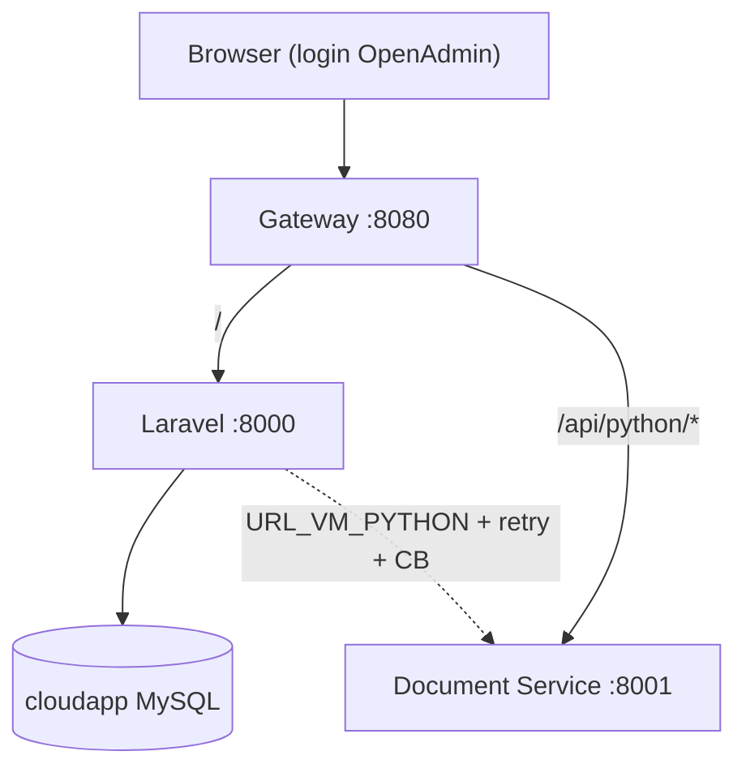
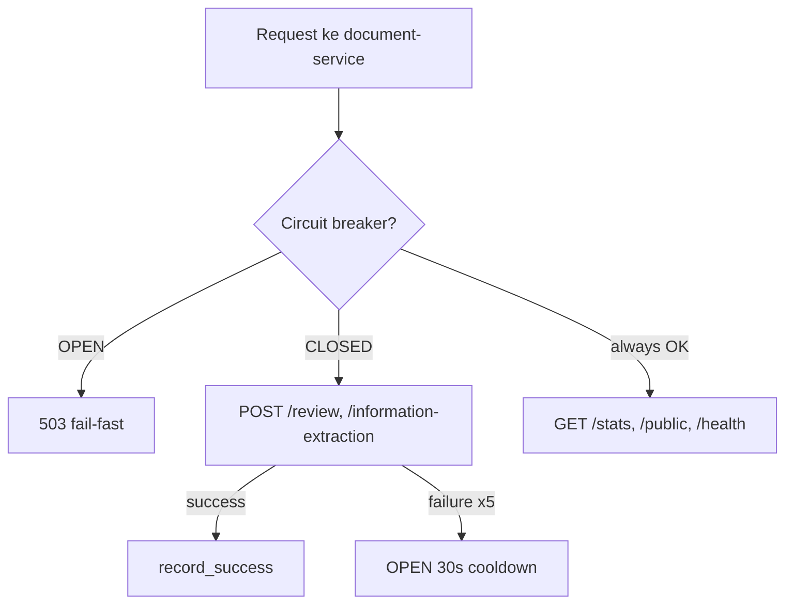

# Arsitektur Microservices — PRIA Solo

Modul 12–13 — stack tim: **Laravel + OpenAdmin** (web & **autentikasi**) + **FastAPI :8001** (document API) + **Nginx gateway** + **reliability patterns**.

## Diagram



## Reliability (Modul 13)



| Pola | Lokasi | Parameter default |
|------|--------|-------------------|
| Retry | `frontend/app/Services/DocumentServiceClient.php` | 3×, backoff 0.5s / 1s / 2s |
| Circuit breaker | `backend/app/reliability/circuit_breaker.py` | threshold 5, cooldown 30s |
| Graceful degradation | `/stats`, `/public` tanpa auth; processing → 503 saat OPEN | Lihat [reliability-testing.md](reliability-testing.md) |
| Rate limit | `services/gateway/nginx.conf` | 20 r/s, burst 40 |

## Autentikasi

| Lapisan | Mekanisme |
|---------|-----------|
| **Pengguna / admin** | **OpenAdmin** — session, `admin` middleware, tabel `admin_users` |
| **Upload & review** | Laravel job/controller → FastAPI (trusted internal network) |
| **GET /stats (UI)** | Route admin `api/document-stats` → proxy ke FastAPI `/stats` |
| **GET /stats (FastAPI)** | Tanpa JWT; hanya untuk pemanggilan internal / admin proxy |

Tidak ada service auth terpisah dan tidak ada duplikasi model user di Python.

## Services & ports

| Service | Port (host) | Peran |
|---------|-------------|--------|
| `gateway` | 8080 | Reverse proxy |
| `frontend` | via gateway | Laravel + OpenAdmin |
| `document-service` | **8001** | FastAPI |
| `db` | 3307 | MySQL |

## API

### Document service (FastAPI)

| Method | Path | Keterangan |
|--------|------|------------|
| GET | `/health` | Healthcheck + dependency circuit breaker |
| GET | `/public` | Info operasional publik (Modul 13) |
| GET | `/stats` | Metrik `TEMP_STORAGE` (tetap saat degraded) |
| POST | `/information-extraction` | Dipanggil Laravel; 503 jika circuit OPEN |
| POST | `/review` | Dipanggil Laravel; 503 jika circuit OPEN |

Gateway: `http://localhost:8080/api/python/...`

### Laravel (OpenAdmin, perlu login)

| Method | Path (prefix admin) | Keterangan |
|--------|---------------------|------------|
| GET | `{admin}/api/document-stats` | Proxy ke FastAPI `/stats` (degraded payload jika down) |
| GET | `{admin}/api/document-public` | Proxy ke FastAPI `/public` |

Contoh: jika prefix admin adalah `admin`, URL  
`http://localhost:8080/admin/api/document-stats` (setelah login OpenAdmin).

## Menjalankan

```bash
docker compose up --build -d
docker compose exec frontend php artisan migrate --force
```

- OpenAdmin: http://localhost:8080/admin (sesuai konfigurasi `config/admin.php`)
- FastAPI docs: http://localhost:8001/docs

## Inter-service

Laravel memanggil document-service dengan `URL_VM_PYTHON` (Compose: `http://gateway/api/python` atau langsung `http://document-service:8001` dari container frontend).

## Debug

```bash
docker compose logs frontend
docker compose logs document-service
docker compose logs gateway
```
