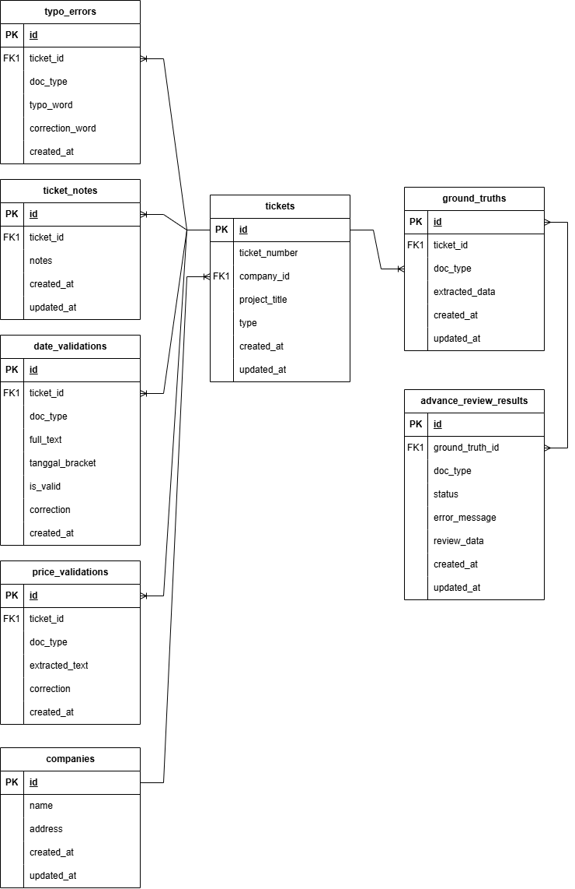

# Schema Database — AI Document Validator

Dokumen ini memuat **schema database lengkap** untuk fitur **AI Document Validator** saja. Semua tabel berikut dipakai oleh alur: upload PDF → ekstraksi (backend) → ground truth → validasi (typo, tanggal, harga) & advance review.

**Sumber:** `frontend/database/migrations/` (Laravel, MySQL).

### Diagram relasi



---

## Daftar Tabel

| No | Tabel | Deskripsi |
|----|--------|-----------|
| 1 | companies | Master perusahaan (untuk pemilihan di tiket) |
| 2 | tickets | Satu tiket = satu batch upload dokumen |
| 3 | ground_truths | Data referensi per tiket & doc_type (hasil ekstraksi yang divalidasi user) |
| 4 | advance_review_results | Hasil advance review AI per ground truth |
| 5 | typo_errors | Daftar typo & koreksi per tiket (basic review) |
| 6 | date_validations | Hasil validasi tanggal per tiket (basic review) |
| 7 | price_validations | Hasil validasi harga per tiket (basic review) |
| 8 | ticket_notes | Catatan untuk satu tiket (satu baris per tiket) |

---

## 1. companies

Master data perusahaan. Dipakai saat membuat tiket (pemilihan perusahaan).

| Kolom | Tipe | Nullable | Default | Keterangan |
|-------|------|----------|---------|------------|
| id | bigint unsigned | NO | — | Primary key, auto increment |
| name | varchar(255) | NO | — | Nama perusahaan |
| address | varchar(255) | YES | NULL | Alamat |
| created_at | timestamp | YES | NULL | |
| updated_at | timestamp | YES | NULL | |

**Index:** PRIMARY (id).

---

## 2. tickets

Satu baris = satu batch upload (satu nomor tiket). Menghubungkan perusahaan dengan ground truth, hasil validasi, dan catatan.

| Kolom | Tipe | Nullable | Default | Keterangan |
|-------|------|----------|---------|------------|
| id | bigint unsigned | NO | — | Primary key, auto increment |
| ticket_number | varchar(50) | NO | — | Nomor tiket, **unique** |
| company_id | bigint unsigned | NO | — | FK → companies.id, **on delete cascade** |
| project_title | varchar(255) | YES | NULL | Judul proyek |
| type | enum('Perpanjangan','Non-Perpanjangan') | NO | 'Non-Perpanjangan' | Tipe tiket |
| created_at | timestamp | YES | NULL | |
| updated_at | timestamp | YES | NULL | |

**Index:** PRIMARY (id), UNIQUE (ticket_number), FK (company_id → companies.id).

---

## 3. ground_truths

Data referensi (ground truth) per tiket dan per tipe dokumen. Satu kombinasi (ticket_id, doc_type) hanya punya satu baris. Diisi/diubah user di halaman validasi ground truth; dipakai backend untuk endpoint `/review`.

| Kolom | Tipe | Nullable | Default | Keterangan |
|-------|------|----------|---------|------------|
| id | bigint unsigned | NO | — | Primary key, auto increment |
| ticket_id | bigint unsigned | NO | — | FK → tickets.id, **on delete cascade** |
| doc_type | varchar(50) | NO | — | Tipe dokumen (mis. P7, BAST) |
| extracted_data | json | NO | — | Data referensi (struktur bebas) |
| created_at | timestamp | YES | NULL | |
| updated_at | timestamp | YES | NULL | |

**Index:** PRIMARY (id), UNIQUE (ticket_id, doc_type), FK (ticket_id → tickets.id).

---

## 4. advance_review_results

Hasil advance review AI per ground truth. Satu ground truth bisa punya beberapa baris (mis. per versi atau per doc_type).

| Kolom | Tipe | Nullable | Default | Keterangan |
|-------|------|----------|---------|------------|
| id | bigint unsigned | NO | — | Primary key, auto increment |
| ground_truth_id | bigint unsigned | NO | — | FK → ground_truths.id, **on delete cascade** |
| doc_type | varchar(50) | NO | — | Tipe dokumen |
| status | varchar(20) | NO | — | Status review |
| error_message | text | YES | NULL | Pesan error jika gagal |
| review_data | json | YES | NULL | Payload hasil review (AI) |
| created_at | timestamp | YES | NULL | |
| updated_at | timestamp | YES | NULL | |

**Index:** PRIMARY (id), FK (ground_truth_id → ground_truths.id).

---

## 5. typo_errors

Daftar typo dan koreksi dari basic review (validasi typo) per tiket.

| Kolom | Tipe | Nullable | Default | Keterangan |
|-------|------|----------|---------|------------|
| id | bigint unsigned | NO | — | Primary key, auto increment |
| ticket_id | bigint unsigned | NO | — | FK → tickets.id, **on delete cascade** |
| doc_type | varchar(255) | NO | — | Tipe dokumen |
| typo_word | varchar(255) | NO | — | Kata yang salah |
| correction_word | varchar(255) | NO | — | Kata koreksi |
| created_at | timestamp | YES | CURRENT_TIMESTAMP | Hanya created_at (tanpa updated_at) |

**Index:** PRIMARY (id), FK (ticket_id → tickets.id).

---

## 6. date_validations

Hasil validasi tanggal dari basic review per tiket.

| Kolom | Tipe | Nullable | Default | Keterangan |
|-------|------|----------|---------|------------|
| id | bigint unsigned | NO | — | Primary key, auto increment |
| ticket_id | bigint unsigned | NO | — | FK → tickets.id, **on delete cascade** |
| doc_type | varchar(255) | NO | — | Tipe dokumen |
| full_text | text | NO | — | Teks lengkap yang divalidasi |
| tanggal_bracket | varchar(20) | NO | — | Tanggal yang diekstrak |
| is_valid | boolean | NO | — | Apakah tanggal valid |
| correction | text | YES | NULL | Koreksi jika tidak valid |
| created_at | timestamp | YES | CURRENT_TIMESTAMP | Hanya created_at |

**Index:** PRIMARY (id), FK (ticket_id → tickets.id).

---

## 7. price_validations

Hasil validasi harga dari basic review per tiket.

| Kolom | Tipe | Nullable | Default | Keterangan |
|-------|------|----------|---------|------------|
| id | bigint unsigned | NO | — | Primary key, auto increment |
| ticket_id | bigint unsigned | NO | — | FK → tickets.id, **on delete cascade** |
| doc_type | varchar(255) | NO | — | Tipe dokumen |
| extracted_text | text | NO | — | Teks yang diekstrak |
| correction | text | YES | NULL | Koreksi jika ada |
| created_at | timestamp | YES | CURRENT_TIMESTAMP | Hanya created_at |

**Index:** PRIMARY (id), FK (ticket_id → tickets.id).

---

## 8. ticket_notes

Catatan untuk satu tiket. Satu tiket hanya boleh punya **satu** baris (unique ticket_id).

| Kolom | Tipe | Nullable | Default | Keterangan |
|-------|------|----------|---------|------------|
| id | bigint unsigned | NO | — | Primary key, auto increment |
| ticket_id | bigint unsigned | NO | — | FK → tickets.id, **on delete cascade**, **unique** |
| notes | json | NO | — | Isi catatan (array/object) |
| created_at | timestamp | YES | NULL | |
| updated_at | timestamp | YES | NULL | |

**Index:** PRIMARY (id), UNIQUE (ticket_id), FK (ticket_id → tickets.id).

---

## Relasi Antar Tabel (AI Document Validator)

```
companies (1) ─────────────< tickets (N)
                                 │
                                 ├──< ground_truths (N) ────< advance_review_results (N)
                                 ├──< typo_errors (N)
                                 ├──< date_validations (N)
                                 ├──< price_validations (N)
                                 └──< ticket_notes (1)      [unique: satu tiket = satu catatan]
```

| Parent | Child | Kolom FK | Jenis | Cascade |
|--------|-------|----------|--------|---------|
| companies | tickets | company_id | One-to-Many | on delete cascade |
| tickets | ground_truths | ticket_id | One-to-Many | on delete cascade |
| tickets | typo_errors | ticket_id | One-to-Many | on delete cascade |
| tickets | date_validations | ticket_id | One-to-Many | on delete cascade |
| tickets | price_validations | ticket_id | One-to-Many | on delete cascade |
| tickets | ticket_notes | ticket_id | One-to-One (unique) | on delete cascade |
| ground_truths | advance_review_results | ground_truth_id | One-to-Many | on delete cascade |

---

## Alur Data (Ringkas)

1. **companies** — dipilih saat buat tiket.
2. **tickets** — dibuat saat upload batch PDF (nomor tiket unik).
3. **ground_truths** — diisi/diupdate user di halaman validasi ground truth; backend pakai untuk `/review`.
4. **advance_review_results** — diisi setelah backend selesai advance review (satu per ground truth / doc_type).
5. **typo_errors**, **date_validations**, **price_validations** — diisi dari hasil basic review (validasi typo, tanggal, harga).
6. **ticket_notes** — catatan bebas per tiket.

---

*Schema ini hanya mencakup tabel yang dipakai fitur AI Document Validator. Tabel lain (users, admin, sessions, projects, dll.) tidak termasuk.*
