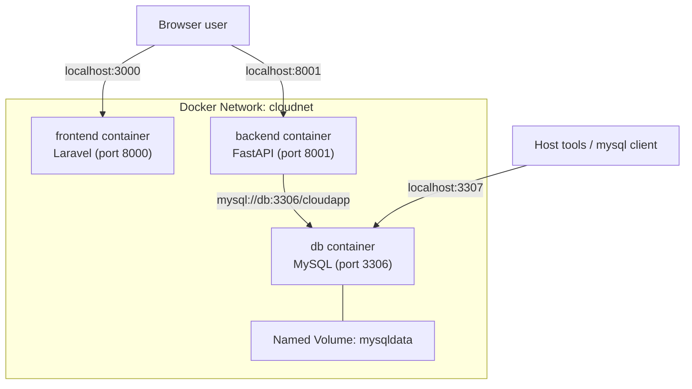

# Docker Architecture (Modul 6 Adaptation)

Dokumen ini merangkum arsitektur multi-container untuk tugas terstruktur Modul 6, disesuaikan dengan codebase `pria-solo`.

## 1) Topology



## 2) Ports, Networks, Volumes

| Komponen | Container Port | Host Port | Keterangan |
|---|---:|---:|---|
| frontend (Laravel) | 8000 | 3000 | Akses UI dari browser |
| backend (FastAPI) | 8001 | 8001 | API docs di `/docs` |
| db (MySQL) | 3306 | 3307 | Host pakai 3307 agar tidak bentrok |
| network | - | - | `cloudnet` |
| volume | - | - | `mysqldata:/var/lib/mysql` |

## 3) Environment Variables Penting

Backend (`backend/.env.docker`):

- `DATABASE_URL=mysql+pymysql://clouduser:cloudpass@db:3306/cloudapp`
- `DB_HOST=db`
- `DB_PORT=3306`
- `MYSQL_USER=clouduser`
- `MYSQL_PASSWORD=cloudpass`
- `MYSQL_DATABASE=cloudapp`
- `DB_WAIT_RETRIES=60`
- `DB_WAIT_SLEEP=2`
- `ALLOWED_ORIGINS=http://127.0.0.1:8000,http://localhost:8000,http://127.0.0.1:3000,http://localhost:3000`

## 4) Startup Sequence

1. Buat network `cloudnet`.
2. Jalankan container `db` dengan volume `mysqldata`.
3. Jalankan `backend` dengan `--env-file backend/.env.docker`.
4. Script `wait-for-db.sh` menunggu MySQL ready sebelum `uvicorn` start.
5. Jalankan `frontend` container Laravel.

## 5) Verifikasi Cepat

```bash
docker ps
docker network inspect cloudnet
docker volume ls
docker logs backend
```

Kriteria sukses:
- Container `db`, `backend`, dan `frontend` berstatus running.
- Tidak ada error koneksi DB saat startup backend.
- Data MySQL tetap ada setelah `db` direcreate dengan volume yang sama.
