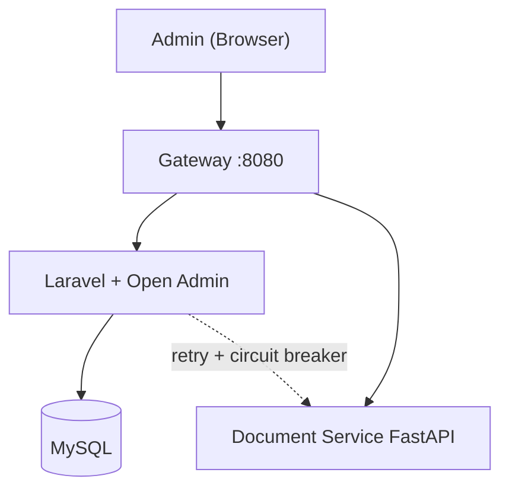

# UAS Presentation Outline — PRIA Solo

**Proyek:** AI Document Validator  
**Tim:** Kelompok A — PRIA Solo  
**Anggota:** Dyno Fadillah Ramadhani (10231033)  
**Durasi target:** ~12 menit presentasi + 8 menit Q&A

---

## Slide 1: Title (30 detik)

- **Nama proyek:** AI Document Validator — PRIA Solo
- **Mata kuliah:** Komputasi Awan — SI ITK
- **Anggota:** Dyno Fadillah Ramadhani (10231033)
- **Konteks:** Magang Telkom Regional IV Kalimantan Timur

---

## Slide 2: Problem & Solution (1 menit)

**Masalah:**

- Review dokumen kontrak/NPK manual memakan waktu dan rawan human error
- Validasi terbilang, tanggal, typo, dan konsistensi antar dokumen sulit diskalakan

**Target pengguna:**

- Tim pre-sales / project management di lingkungan Telkom

**Solusi:**

- Upload PDF → OCR (Azure DI) → AI review (LangChain/OpenAI)
- UI admin Laravel Open Admin untuk workflow upload, review, dan catatan

---

## Slide 3: Architecture Journey (2 menit)

| Phase | Weeks | Architecture |
|-------|-------|--------------|
| Foundation | 1–4 | Monolith mental model: FastAPI + Laravel + MySQL |
| Containerization | 5–7 | Docker Compose (backend, frontend, DB) |
| CI/CD | 9–11 | GitHub Actions → Railway deploy |
| Microservices | 12–14 | Nginx gateway + document-service + observability |
| Final | 15–16 | Security hardening + dokumentasi + UAS |

**Diagram final:**



---

## Slide 4: Tech Stack & Infrastructure (2 menit)

- **Frontend:** Laravel 8, Open Admin, Blade, Guzzle
- **Backend:** FastAPI, Azure Document Intelligence, LangChain, OpenAI
- **Infra:** Docker Compose (4 containers), Nginx gateway, MySQL 8
- **CI/CD:** GitHub Actions — ruff, pytest, phpunit, build, Railway deploy
- **Observability:** JSON logging, correlation ID, `/metrics`, `/status` dashboard
- **Security:** Rate limiting, env-based secrets, CORS whitelist, input validation

---

## Slide 5: Live Demo (3 menit)

**Urutan demo:**

1. Buka production URL atau `http://localhost:8080`
2. Login Open Admin (`/projess/auth/login`)
3. Upload dokumen PDF (advance review flow)
4. Jalankan information extraction
5. Tampilkan hasil review / validasi
6. Buka `/status` — health + metrics
7. Tampilkan GitHub Actions badge (CI hijau)

**Backup:** Rekaman video 3 menit di Google Drive jika WiFi UAS bermasalah.

---

## Slide 6: Challenges & Lessons Learned (2 menit)

| Challenge | Solution |
|-----------|----------|
| Integrasi Laravel ↔ FastAPI (upload besar, timeout) | Gateway timeout 600s, job queue Laravel, `URL_VM_PYTHON` via gateway |
| OCR/AI latency & biaya API | Circuit breaker + retry di DocumentServiceClient |
| Image Docker frontend besar | Multi-stage build roadmap; dokumentasi ukuran image |
| Auth model berbeda dari template kuliah (JWT) | Session Open Admin + trusted internal call ke FastAPI — dijelaskan di viva |

**Biggest learning:** Cloud-native bukan hanya deploy ke cloud — observability, rate limiting, dan secret management sama pentingnya dengan fitur aplikasi.

---

## Slide 7: Team Contributions (1 menit)

| Nama | Peran | Kontribusi | Metrics |
|------|-------|------------|---------|
| Dyno Fadillah Ramadhani | Backend, Frontend, DevOps, QA | Full-stack, CI/CD, docs, gateway | ~45 commits |

---

## Demo Script (langkah teknis)

```bash
# 1. Pastikan stack jalan
docker compose up -d
./scripts/verify-final.sh

# 2. Health
curl http://localhost:8080/health
curl http://localhost:8080/api/python/health

# 3. Metrics
curl http://localhost:8080/api/python/metrics | python -m json.tool

# 4. (UI) Login → upload → review → /status
```

---

## Pertanyaan viva — jawaban singkat

1. **Arsitektur end-to-end?** Browser → Nginx → Laravel (auth/UI) → FastAPI (processing) → Azure/OpenAI
2. **Monolith vs microservices?** Kita pisahkan document processing ke service terpisah agar bisa scale & isolate failure; trade-off: kompleksitas operasi
3. **CI/CD flow?** Push/merge ke `main` → lint + test + build Docker → deploy Railway → health check
4. **Auth service down?** Laravel proxy ke FastAPI dengan retry + circuit breaker; UI degraded message
5. **12-Factor?** Config di env (III), logs stdout (XI), disposability containers (IX), dev/prod parity via Docker (X)
6. **Secret management?** `.env` lokal, Railway vars production, GitHub Secrets untuk CI — tidak di Git
7. **Create item flow (adaptasi):** Upload PDF → Laravel job → POST `/api/python/information-extraction` → simpan hasil → POST `/review`
8. **Traffic 10x?** Scale horizontal `document-service` (CPU/API bound); gateway + rate limit; pertimbangkan queue untuk OCR
