# Hasil Testing UI — AI Document Validator

Dokumen ini memuat **dokumentasi hasil testing UI** untuk memenuhi **Tugas 3 Modul 3** (Bagian C — Lead QA & Docs: `docs/ui-test-results.md`).  
Penyesuaian: alur testing tidak memakai contoh React CRUD `items`, tetapi **alur nyata** pada aplikasi **AI Document Validator** di repo *pria-solo*.

---

## 1. Informasi Testing

| Item | Keterangan |
|------|------------|
| **URL Frontend** | `http://127.0.0.1:8000` (Laravel + OpenAdmin) |
| **Halaman utama yang di-test** | `advance-reviews/document-review-main-page.blade.php` (landing + modal upload) |
| **Browser** | *(isi: mis. Chrome 123, Edge, dsb.)* |
| **Tanggal test** | *(isi tanggal saat testing dilakukan)* |
| **Backend** | FastAPI — Document Validator API (`http://127.0.0.1:8001`) |
| **Status backend** | Pastikan `GET /health` → `{"status": "healthy", ...}` sebelum test UI |

---

## 2. Ringkasan 10 Test Case UI

Tabel ini memetakan “10 langkah testing” di Modul 3 (untuk React CRUD) ke **alur validasi dokumen** di AI Document Validator.

| No | Nama Test Case | Tujuan Singkat |
|----|----------------|----------------|
| 1 | Buka halaman utama Document Review | Pastikan hero section & CTA muncul normal |
| 2 | Buka modal upload dari tombol “Mulai Review” | Pastikan modal muncul dan form upload tampil |
| 3 | Upload file valid & mulai proses | Pastikan overlay loading muncul saat proses berjalan |
| 4 | Skenario sukses: proses ekstraksi & review berhasil | Pastikan modal sukses tampil setelah proses |
| 5 | Redirect ke halaman hasil review | Pastikan user diarahkan ke halaman hasil/summary |
| 6 | Skenario error: upload tanpa file / file invalid | Pastikan modal error tampil dengan pesan yang tepat |
| 7 | Reset form setelah error | Pastikan form di modal sudah ter-reset setelah error |
| 8 | Retry setelah error dengan data benar | Pastikan alur sukses berjalan normal setelah retry |
| 9 | Verifikasi tampilan hasil review | Pastikan hasil validasi/advance review tampil lengkap |
| 10 | Cek riwayat / daftar tiket terkait | Pastikan tiket muncul di daftar riwayat (jika tersedia) |

Setiap test case di bawah dapat dilengkapi dengan **screenshot aktual** dari browser (disarankan minimal 1 screenshot per test).

---

## 3. Detail Test Case

### Test Case 1 — Buka Halaman Utama Document Review

- **Langkah:**
  1. Jalankan frontend Laravel (`php artisan serve --port=8000`) dan backend FastAPI (`uvicorn app.main:app --reload --port 8001`).
  2. Buka browser dan akses `http://127.0.0.1:8000` (atau route admin yang mengarah ke halaman Document Review).
  3. Pastikan halaman `document-review-main-page.blade.php` ter-render.
- **Expected result:**
  - Hero section tampil dengan judul seperti **“Validasi Dokumen dengan Mudah!”**.
  - Terdapat tombol utama **“Mulai Review”** (CTA) yang akan membuka modal upload.
  - Tidak ada error JavaScript/console yang fatal.
- **Screenshot:** 
  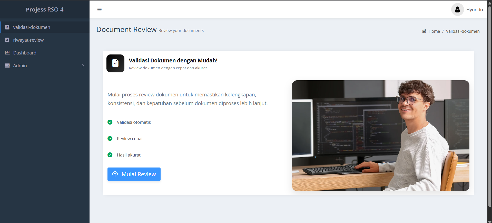

---

### Test Case 2 — Buka Modal Upload dari Tombol “Mulai Review”

- **Langkah:**
  1. Pada halaman utama, klik tombol **“Mulai Review”** yang memiliki atribut `data-bs-target="#uploadModalAdvanced"`.
  2. Amati tampilan modal yang muncul.
- **Expected result:**
  - Modal upload dengan ID `uploadModalAdvanced` muncul di tengah layar.
  - Di dalam modal terdapat:
    - Input untuk upload file dokumen (PDF).
    - Field lain yang wajib diisi (mis. ticket, tipe dokumen, dsb., sesuai implementasi).
  - Latar belakang halaman menjadi diblur/gelap (efek modal Bootstrap).
- **Screenshot:** 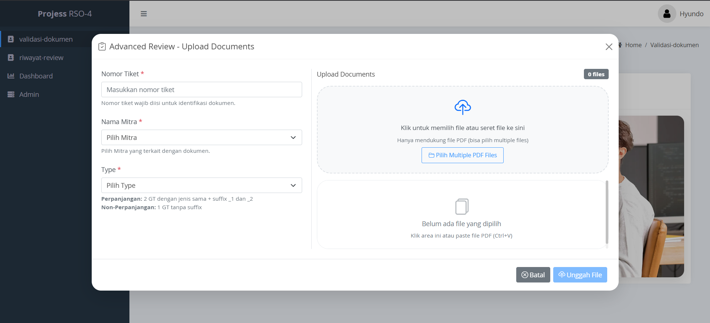

---

### Test Case 3 — Upload File Valid & Mulai Proses

- **Langkah:**
  1. Di dalam modal upload:
     - Pilih satu file PDF yang valid (ukuran wajar, format benar).
     - Isi semua field wajib (mis. `ticket`, pilihan jenis dokumen, dll.).
  2. Klik tombol **Submit / Mulai Review** di modal (yang memicu JS `file-upload-handler.js`).
- **Expected result:**
  - Modal tertutup atau dikunci sementara.
  - **Loading overlay** dengan teks seperti *“Ekstraksi Informasi…”* muncul (elemen `#loadingOverlay` di halaman).
  - Tidak ada pesan error langsung; network tab di browser menunjukkan request ke backend FastAPI (mis. `/information-extraction` dan/atau `/review`).
- **Screenshot:** 
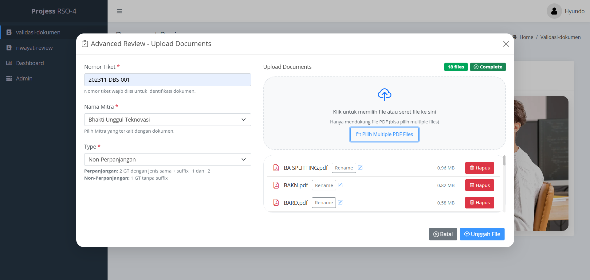
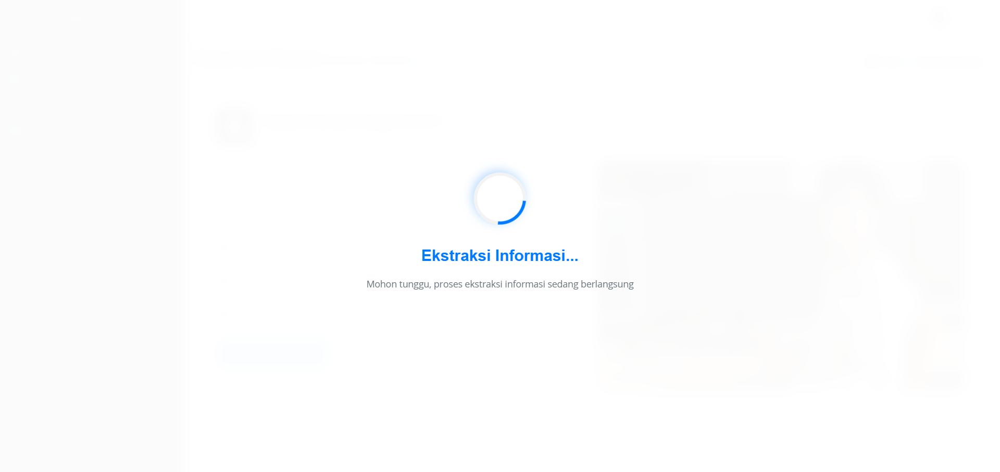

---

### Test Case 4 — Skenario Sukses: Ekstraksi & Review Berhasil

- **Prasyarat:** Backend siap menerima file (konfigurasi OCR/AI sudah benar di `.env` backend).
- **Langkah:**
  1. Lanjutkan dari Test Case 3, biarkan proses berjalan sampai selesai.
  2. Amati tampilan setelah overlay loading menghilang.
- **Expected result:**
  - Overlay loading menghilang.
  - **Success modal** dengan ID `successModal` muncul:
    - Ikon sukses (`bi-check-circle-fill`) tampil.
    - Teks judul kurang lebih: **“Validasi Berhasil!”**.
    - Pesan yang menyatakan bahwa dokumen akan diarahkan ke halaman hasil.
  - Tidak ada error JS di console.
- **Screenshot:** 
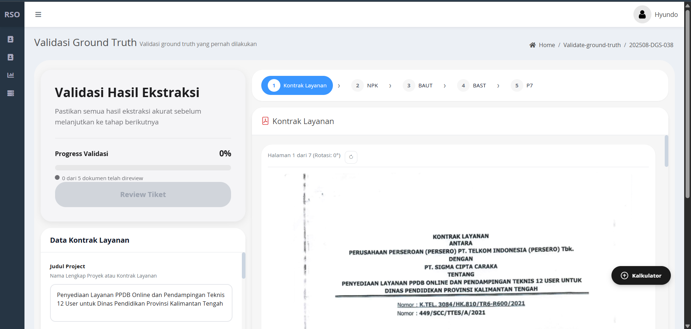

---

### Test Case 5 — Redirect ke Halaman Hasil Review

- **Langkah:**
  1. Setelah success modal muncul, tunggu beberapa detik (atau klik tombol/aksi yang memicu redirect).
  2. Perhatikan URL dan konten halaman baru.
- **Expected result:**
  - User diarahkan ke halaman hasil review/summary yang menampilkan:
    - Informasi tiket.
    - Ringkasan hasil validasi (typo/date/price) dan/atau advance review.
  - Layout hasil sesuai template di `resources/views/advance-reviews/templates/` (mis. `review-overview`, `basic-review-result`, dsb.).
- **Screenshot:** 
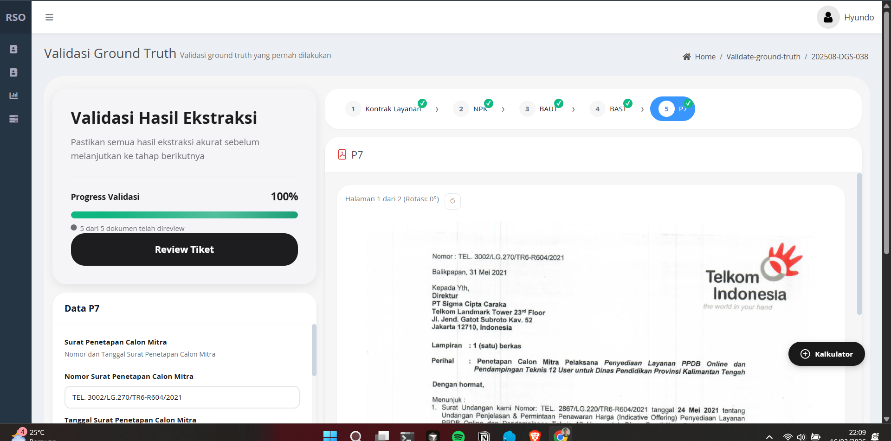
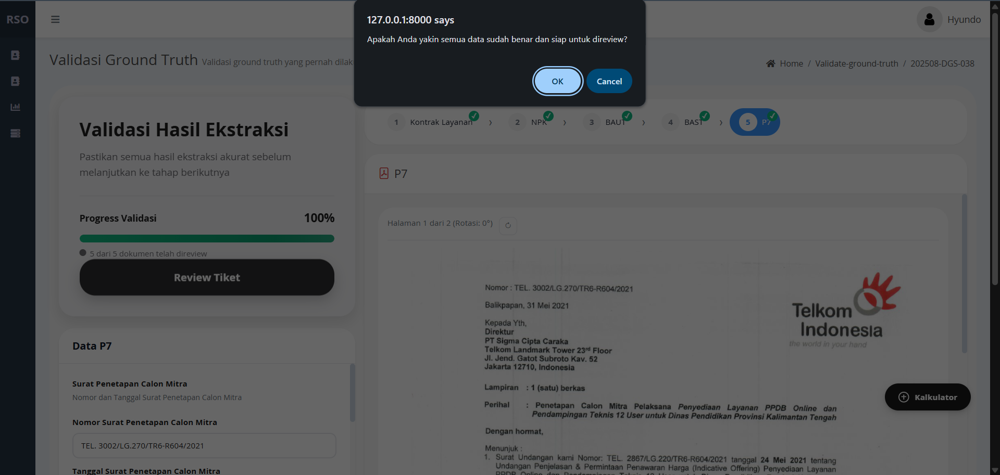
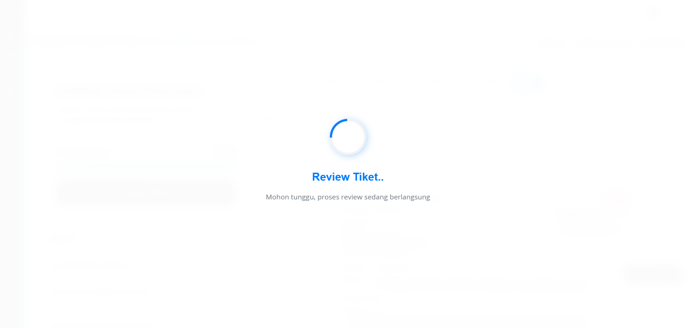
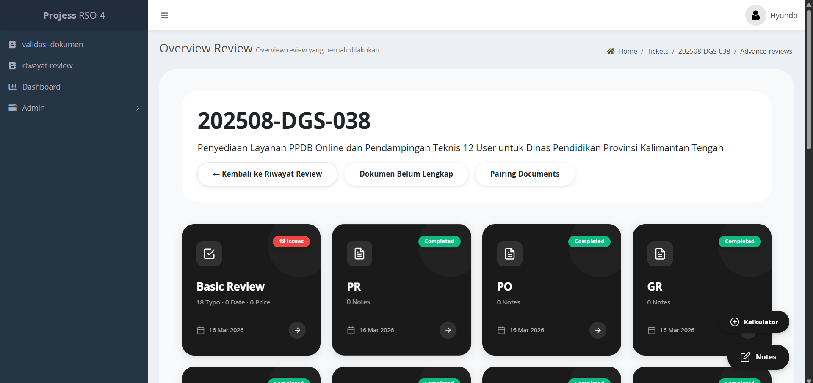

---

### Test Case 6 — Skenario Error: Upload Tanpa File / File Invalid

- **Langkah:**
  1. Buka kembali modal upload (seperti Test Case 2).
  2. Lakukan salah satu skenario:
     - Klik submit tanpa memilih file.
     - Atau, pilih file dengan format tidak valid (bukan PDF), jika validasi mengizinkan.
  3. Klik tombol Submit/Mulai Review.
- **Expected result:**
  - Request ke backend gagal atau dicegat oleh validasi frontend.
  - **Error modal** dengan ID `errorModal` muncul:
    - Judul kira-kira: **“Upload Gagal!”**.
    - Pesan error spesifik di elemen `#errorMessage`, misalnya “file wajib diisi” / “format tidak didukung” / pesan dari backend.
    - Teks tambahan di bawah menjelaskan bahwa form sudah di-reset.
- **Screenshot:** 
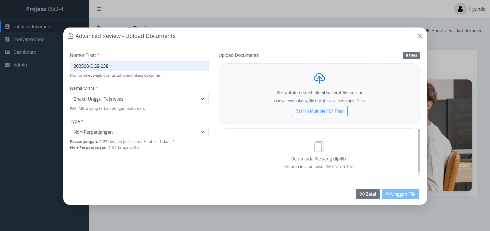

---

### Test Case 7 — Reset Form Setelah Error

- **Langkah:**
  1. Setelah Test Case 6, tutup error modal dengan tombol **Tutup**.
  2. Buka kembali modal upload.
  3. Periksa nilai field di form.
- **Expected result:**
  - Semua nilai input di modal upload **sudah kosong / kembali ke nilai default** (sesuai pesan di error modal: *“Form sudah di-reset”*).
  - Tidak ada file yang masih terpilih secara otomatis.
- **Screenshot:** 

---

### Test Case 8 — Retry Setelah Error dengan Data Benar

- **Langkah:**
  1. Setelah memastikan form sudah reset (Test Case 7), ulangi proses upload dengan data yang benar:
     - Pilih file PDF valid.
     - Isi seluruh field wajib dengan benar.
  2. Submit form kembali.
- **Expected result:**
  - Overlay loading muncul seperti di Test Case 3.
  - Proses berakhir dengan success modal seperti di Test Case 4.
  - Redirect ke halaman hasil seperti di Test Case 5.
  - Tidak ada “state sisa” dari error sebelumnya (artinya error tidak membuat UI masuk kondisi rusak).
- **Screenshot:** 

---

### Test Case 9 — Verifikasi Tampilan Hasil Review

- **Langkah:**
  1. Pada halaman hasil review yang muncul setelah Test Case 5/8:
     - Periksa bagian header (informasi tiket, jenis dokumen, status).
     - Periksa bagian detail hasil validasi (typo/date/price) dan advance review.
  2. Scroll jika perlu untuk melihat seluruh konten.
- **Expected result:**
  - Informasi utama tiket (nomor tiket, nama perusahaan/proyek) tampil benar.
  - Blok hasil validasi (mis. tabel atau kartu) menampilkan data yang konsisten dengan dokumen yang diupload.
  - Jika ada highlight error/remark dari AI, tampil dengan styling yang jelas (warna, ikon, dsb.).
- **Screenshot:** 
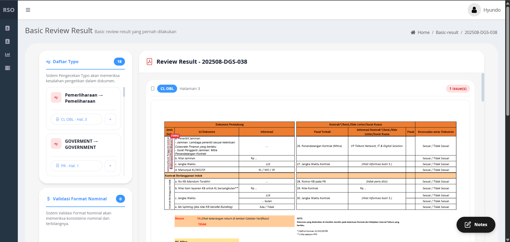
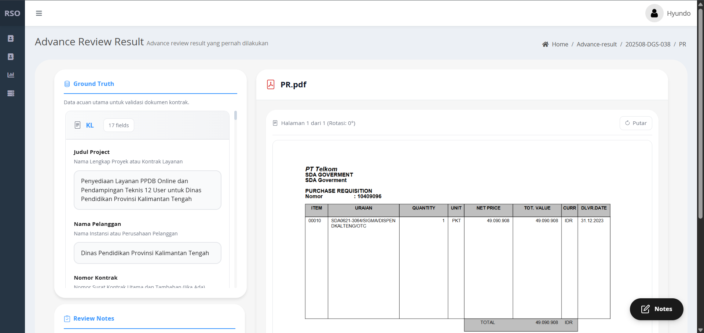

---

### Test Case 10 — Cek Riwayat / Daftar Tiket

- **Langkah:**
  1. Dari halaman hasil review atau dari menu admin, buka halaman riwayat/daftar tiket yang terkait dengan Document Validator (mis. `advance-reviews/history-page.blade.php` atau grid OpenAdmin yang menampilkan tiket).
  2. Cari tiket yang digunakan pada Test Case sebelumnya (berdasarkan `ticket_number`, tanggal, atau filter lain).
- **Expected result:**
  - Tiket yang baru diproses muncul di daftar riwayat dengan:
    - Nomor tiket yang benar.
    - Status yang sesuai (mis. “completed”).
    - Timestamp yang masuk akal (mendekati waktu pengujian).
  - Jika listing mendukung sorting/filter, fitur tersebut dapat digunakan untuk menemukan tiket dengan mudah (melengkapi konsep “sorting/pagination” dari modul).
- **Screenshot:** 
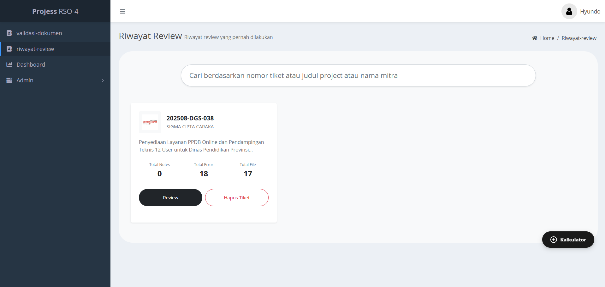

---

## 4. Catatan Tambahan

- **Kegagalan test:**  
  Jika salah satu test case gagal (mis. success modal tidak muncul, atau redirect tidak terjadi), catat:
  - Nomor test case.
  - Langkah persis yang dilakukan.
  - Pesan error (dari UI atau console browser).
  - Rencana perbaikan (mis. cek JS `file-upload-handler.js`, cek konfigurasi endpoint backend, cek `.env`).

- **Hubungan dengan Modul 3:**  
  10 test case di atas secara konsep menggantikan:
  - “Tambah/Edit/Hapus item” → “Upload, review, dan melihat hasil dokumen”.
  - “Toast/notification” → “Modal sukses/error + overlay loading”.
  - “Daftar items” → “Halaman hasil + riwayat tiket”.

Dengan dokumentasi ini, **Tugas UI testing Modul 3** dinyatakan terpenuhi untuk aplikasi AI Document Validator di codebase *pria-solo*.

